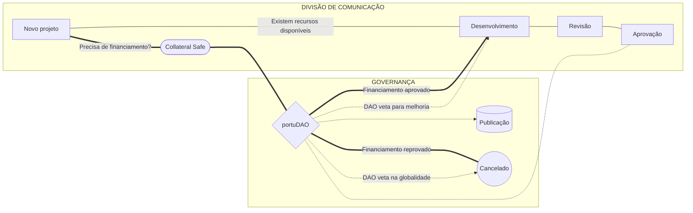

# Comunicação e Documentação

## Introdução

A divisão de comunicação da PortuDAO é responsável pela gestão e pela publicação da documentação e da comunicação da DAO. Aqui reúnem-se pessoas que têm um gosto pela comunicação (principalmente escrita).

Parte do nosso trabalho começa aqui, por iniciativa direta dos membros do grupo  e outra parte acontece em cooperação direta com outros grupos de trabalho, como é o caso da [Engenharia e Segurança](engenharia-e-seguranca.md).

## Modelo de organização

Tal como nos outros grupos, os membros da portuDAO podem participar livremente no grupo de trabalho.

Para facilitar o trabalho interno existem um conjunto de membros chave responsáveis por `(1)` organizar o trabalho do grupo, `(2)` convocar e liderar as reuniões e `(3)` manter um registo atualizado das atividades. A estrutura não é rígida, ou seja, por ora não carece de nenhum tipo de aprovação ou votação pela DAO. Estes membros são nomeados diretamente pelo grupo e não existem mandatos fixos, ilimitados ou qualquer orgânica formal rígida. A qualquer altura podem ser substituídos. O nosso foco são os resultados alcançados.

## Gestão de projeto

Durante a fase inicial de criação da portuDAO, os grupos de trabalho desfrutam de autonomia e confiança. Há porém algumas regras que devem ser respeitadas. Desde logo, a maioria das iniciativas tem origem da DAO ou noutros grupos de trabalho e, obviamente, todas as inciativas se centram nos interesses da DAO. Podemos decidir diretamente sobre alguns temas, mas à DAO cabe sempre o direito de veto.

### Workflow: Comunicação e Documentação

### Reuniões semanais

A divisão de comunicação reune todas as terças-feiras.

### Repositório de ficheiros

Os ficheiros criados e utilizados por este grupo de trabalho encontram-se disponíveis numa pasta partilhada no [Google Drive](https://drive.google.com/drive/folders/17d0uCj4NcsAjd2O5ldoBAAO\_8oncYyBL).

### Política de gestão de documentos

Para facilitar o trabalho de quem cria, dos revisores e da própria portuDAO no momento de decidir, introduzimos uma [política de gestão de documentos](politica-de-gestao-de-documentos.md). Na prática, consiste num conjunto de boas práticas que regulam o processo de desenvolvimento dos documentos desde a fase em que são propostos até ao momento em que são disponibilizados, altura em que são marcados como finais.

### Formato dos entregáveis

Considerando que a função principal do grupo de trabalho é a produção de documentação, os entregáveis devem ser disponibilizados em [Markdown](https://docs.github.com/pt/get-started/writing-on-github/getting-started-with-writing-and-formatting-on-github/basic-writing-and-formatting-syntax).

Obviamente não impede que cada um use as ferramentas que melhor se adequem ao seu perfil  Se não te sentes conforável com Markdown e quiseres colaborar, podes apresentar o teu trabalho no formato que quiseres. No fim do processo vais encontrar de certeza alguém disponível para te ajudar a converter o teu trabalho para .md.

### Coordenação do grupo

Neste grupo de trabalho reúnem-se pessoas que têm um gosto pela comunicação (principalmente escrita), pela criação de conteúdo que transmita as ideias até então não materializadas. Pessoas com gosto pela organização e documentação de informação.

### Colabora connosco

Para te juntares a nós precisas, em primeiro lugar, de entrar no nosso grupo no [Telegram.](https://t.me/portudao_comunicacao).

Junta-te e apresenta-te. Temos todo o gosto em contar com a tua ajuda!
